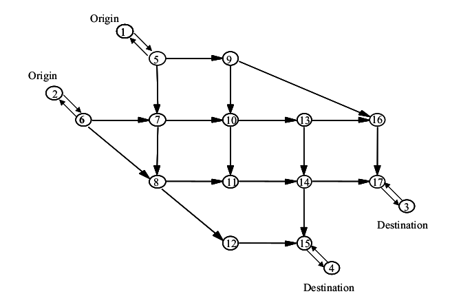
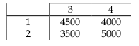

**USER-EQUILIBRIUM-SOLUTION**

**PART I INSTRUCTIONS**

1. Use the *create_template.py* to build a template Excel file. Before running it, you're supposed to revise the file location to where you want to save it. Remember that all the data will be read from this template later.
2. Fill in your own data into the template. Please follow the given format, or the program may not function well.  Moreover, the road network can NOT contain a loop. (Now there is no code to detect if  there exists a loop in the network graph, but I hope that I could add it soon)
3. Revise the data file (the template) location and accuracy parameters in the *main.py* as your prefer. However, do NOT let the accuracy of convex program's solution too small, or the Franke-Wolfe Algorithm can not converge.
4. Run the *main.py*, then analyze the output.

**PART II PRINCIPLES**

First I'd like to introduce the Wardrop's Principle, i.e., the definition of user-equilibrium.

> For each O-D pair, at user equilibrium, the travel time on all used paths is equal, and (also) less than or equal to the travel time that would be experienced by a single vehicle on any unused path. This definition means that at equilibrium, the paths connecting each O-D pair can be divided into two groups. The first group includes paths that carry flow. The travel time on all these paths will be the same. The other group includes paths that do not carry any flow. The travel time on each of these paths will be at least as large as the travel time on the paths in the first group.
>
> A stable condition is reached only when no traveler can improve his travel time by unilaterally changing routes. This is the characterization of the user-equilibrium (UE) condition.

This program is aimed to obtain the user-equilibrium solution of given traffic demand and road network.  The mathematical model is demonstrated as follows:

$$
\min z(x) = \sum_a \int_0^{x_a} t_a(\omega) d\omega
$$
subject to:
$$
\sum_k f^{rs}_k = q_{rs}  \  \  \forall r,s
$$

$$
f^{rs}_k \ge 0 \ \ \forall k,r,s
$$

$$
x_a = \sum_r \sum_s \sum_k f^{rs}_k \delta^{rs}_a,k \ \ \forall a
$$

Where x_a is the flow on link a, f_k is the flow on path k connecting origin r with destination s, and delta is the Link-Path Incidence Matrix. 

the function t is the performance function, which indicates the relationship between flows (traffic volume) and  travel time on the same link. According to the suggestion from the Federal Highway Administration (FHWA), we could use the following function:
$$
t(x) = t_0(1+\alpha{({\frac x c})^\beta})
$$
Where x is the link flow, c is the capacity, t_0 is the free flow travel time. As usual, we can set the alpha as 0.15 and the beta as 4.

We can notice that the objective function is physically meaningless, but it was proved that the optimal solution of  this program problem exactly is the user-equilibrium solution. If you're interested, please read the book Urban *Transportation Networks: Equilibrium Analysis with Mathematical Models* by Yosef Sheffi, Professor at Massachusetts Institute of Technology. 

Meanwhile, this program is a convex program, we can use Frank-Wolfe Algorithm to solve it, the steps of the algorithm are displayed as follows:

**Step 0: Initialization.** Perform the all-or-nothing assignment based on the zero link flow. This yields x^n_a.

**Step 1: Update.** Set:
$$
t^n_a = t_a(x^n_a) \ \ \forall a
$$
**Step 2: Direction finding.** Perform the all-or-nothing assignment based on the t^n_a. This yields a set of auxiliary link flows y^n_a.

**Step 3: Line search.** Find theta that solves:
$$
\min_{0 \le \theta \le 1} \sum_a \int^{x^n_a+\theta(y^n_a-x^n_a)}_0 t_a(\omega) d\omega
$$
further, we can use the dichotomy method to solve it, because it is a convex function.

let:
$$
f(\theta) = \sum_a \int^{x^n_a+\theta(y^n_a-x^n_a)}_0 t_a(\omega) d\omega
$$
thus:
$$
f'(\theta) = \sum_a  t_a(x^n_a+\theta(y^n_a-x^n_a)) (y^n_a-x^n_a)
$$

$$
f''(\theta) = \sum_a  t'_a(x^n_a+\theta(y^n_a-x^n_a)) (y^n_a-x^n_a)^2
$$

Because the function t is strictly increasing, so we can know:
$$
f''(\theta) \ge 0
$$

**Step 4: Move.** Set:
$$
x^{n+1}_a = x^n_a+\theta(y^n_a-x^n_a)
$$

**Step 5: Convergence test.** If a convergence criterion is met, stop, the current solution  is the set of equilibrium link flows; otherwise, go to step 1. In my program, the convergence test is as follows:
$$
\frac {\| x^{n+1}-x^n \|} {\|x^n\|} \le \epsilon
$$

**PART III EXAMPLES**

In the file *create_template.py*, there is a good example. The graph is as follows:

The basic data of this network is given as a table:

We are also supposed to input the information of demand into the program:

Then, we can follow the instructions and run the program, then yield the output we expect.
